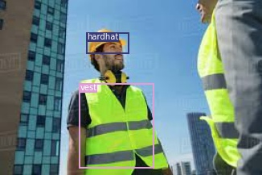
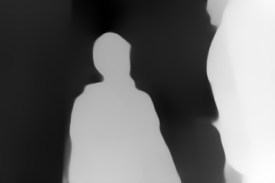
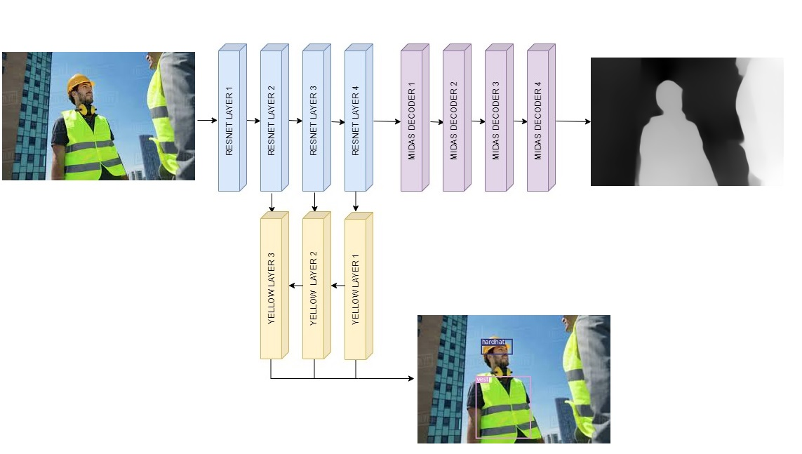

# EVA5-Capstone

## Target

The aim to the project is to create a network that can perform 3 tasks simultaneously:

- Predict the boots, vest, hardhat, and mask if there is in an image
- Predict the depth map of the image
- Predict the Planar Surfaces in the region

    


## Dataset

Dataset Link : https://drive.google.com/drive/folders/1W8J2TDzvfRWhJXgJQVh77E1i2o_4Ie9e?usp=sharing

## Directory Structure:


```bash
Construction PPE Kit
    ├── Annotated Images
    |   ├── images
    |   |   ├── image_0001.jpg
    |   |   ├── image_0002.jpg
    |   |   ├── ...
    |   |   ├── image_3521.jpg
    |   ├── labels
    |   |   ├── image_0001.txt
    |   |   ├── image_0002.txt
    |   |   ├── ...
    |   |   ├── image_3521.txt
    ├── Depth Images using MiDaS
    |   ├── image_0001.png
    |   ├── image_0002.png
    |   ├── ...
    |   └── image_3521.png
    |── Planer images using PlanerCNN
        ├── image_0001.png
        ├── image_0002.png
        ├── ...
        └── image_3521.png    
```

## Approach

The very first approach to solve the problem is to use 3 models. 
- Yolov3 for image classification and localisation
- MiDaS for depth map prediction
- PlaneRCNN for planer surface segmentation

But, All these three networks use Resnet as their backbone(feature extractor). So we can take advantage of the fact. We can take a pretrained backbone from any one of the models and replace it in other two models. 
We see that the MiDaS is trained on a various(approx 10) datasets. Since MiDaS network is trained on variety of data its feature extractor must be rich and we can take the MiDaS Resnet as backbone for the entire network.

## Subproblem
The problem is divided into two subproblems for simplicity as the original problem is quite complex.

- Solving depth estimation and object localisation.
- Combining the above network with plane detection.

### Depth Estimation and Localisation
For depth estimation the MiDaS network can be used as it because MiDaS is already trained of huge datasets and it is difficult to train a network better than intel.And for image localisation the yolo layers can be attached to MiDaS resnet.

#### MiDaS Training 
To make the entire network trainable MiDaS need to trainable too. 
Loss function tested on Midas were <b>SSIM Loss</b> and <b>MSE Loss</b>.
The SSIM loss fuction performed very good with MiDaS.

#### Yolo Training
Yolo was trained on resnet feature extractor. The loss function was the yolov3 loss function. Since the model was using resnet as backbone instead of darknet, the model was finetuned by unfreezing the last two layers of the resnet.

#### Architecture



